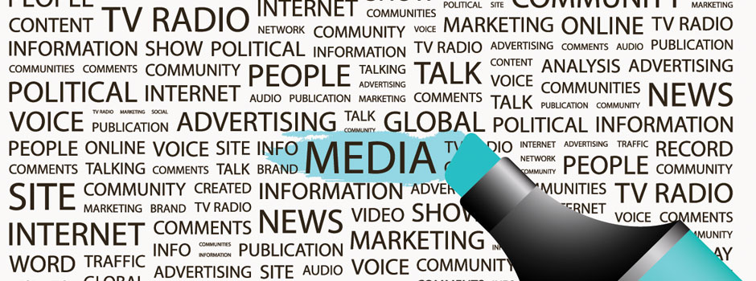
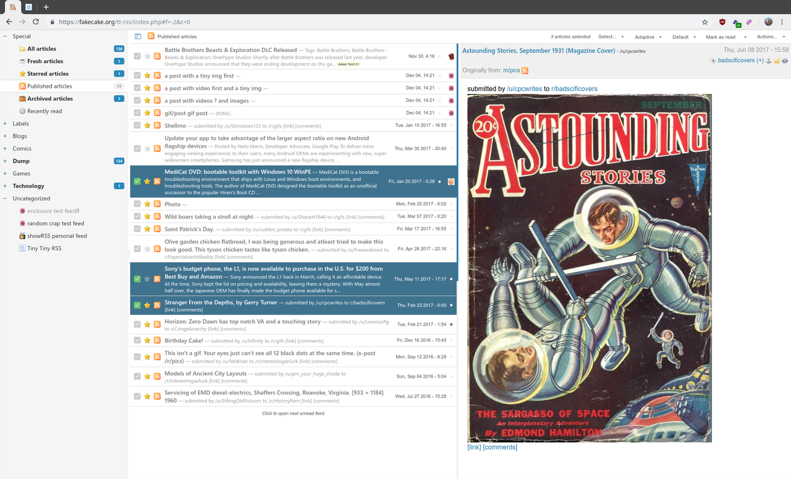
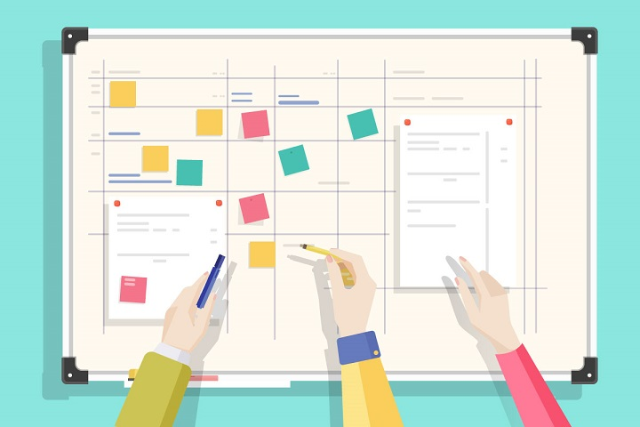
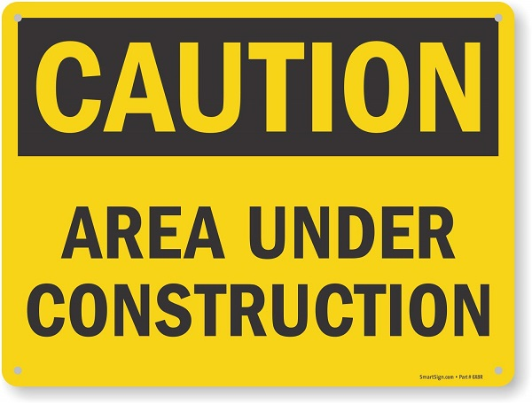

<!-- page_number: true -->
<!-- footer: Veille technologique et outils -->

Veille technologique et outils
===


##### Comment réaliser une veille technologique efficace

###### par [Fabien Barbaud](fabien.barbaud@timeonegroup.com) - [@BarbaudFabien](https://twitter.com/BarbaudFabien)

---

# Objectifs de la session

- Comprendre la veille technologique
- Choisir ses sources
- Savoir organiser une bonne veille
- Construire son propre environnement de veille

---

# C'est quoi faire de la veille ?


---

# C'est quoi faire de la veille ?

## Définition

> La veille technologique [...] consiste à **s'informer** de façon **systématique** sur les techniques les plus **récentes** et surtout sur leur **mise à disposition commerciale** (ce qui constitue la différence entre la technique et la technologie).

[Wikipédia - Veille technologique](https://fr.wikipedia.org/wiki/Veille_technologique)

---

# C'est quoi faire de la veille ?

## S'informer de façon systématique

[Systématique](https://www.linternaute.fr/dictionnaire/fr/definition/systematique/)

> Organisé avec méthode et rigueur.
Synonymes : ordonné, organisé, rigoureux, réglé, méthodique


---

# C'est quoi faire de la veille ?

## Techniques les plus récentes

- Actuelles ou futures
- Réalistes et applicables 

---

# C'est quoi faire de la veille ?

## Mise à disposition commerciale

- Quand et dans quelles conditions
- Pour qui et avec quel coût 

---

# Avant les outils : les sources !



---

# Avant les outils : les sources !

## Une bonne source

- Vérifier le site : éditeur, mentions légales, sponsors, ...
- Identifier le ou les auteurs et leurs compétences
- Déterminer les éventuels conflits d'intérêt

---

# Avant les outils : les sources !

## Une bonne source

### Exercice pratique "Chercher la source de la source" :

- [Article 1](https://www.journaldunet.com/solutions/expert/71240/de-la-production-industrielle-a-l-ere-du-tout-numerique--il-n-y-a-qu-un-pas.shtml)
- [Article 2](https://www.journaldunet.com/ebusiness/expert/71278/non--les-gafa-ne-nous-dominent-pas-grace-a-leur-audience-et-a-leur-data.shtml)
- [Article 3](https://www.journaldunet.com/solutions/seo-referencement/1438910-la-june-2019-core-update-l-outil-anti-fake-news-de-google/)

---

# Avant les outils : les sources !

## Les types de sources

- Sites d'actualité
- Réseaux sociaux
- Communiqués de presse
- Blogs
- Sites spécalisés
- Bases de données de brevets
- ...

---

# Avant les outils : les sources !

## Les types de sources

### Exercice pratique "Trouver de nouvelles sources" :

- Fintech
- Big Data
- Design graphique
- Langage NodeJS

---

# Les outils pour réussir sa veille techno


[TECH**2**TECH](https://www.tech2tech.fr/feedly-remplacant-ideal-de-google-reader/)

---

# Les outils pour réussir sa veille techno

## Le flux RSS (_Really Simple Syndication_)

- données au format XML
- diffuse les mises à jour du contenu d'une ou plusieurs sources
- demande l'utilisation d'un aggrégateur pour être lu
- permet de réunir plusieurs sources RSS différentes

---

```xml
<?xml version="1.0" encoding="UTF-8"?>
<rss version="2.0">
    <channel>
        <title>Mon site</title>
        <description>Ceci est un exemple de flux RSS 2.0</description>
        <lastBuildDate>Sat, 07 Sep 2002 00:00:01 GMT</lastBuildDate>
        <link>http://www.example.org</link>
        <item>
            <title>Actualité N°1</title>
            <description>Ceci est ma première actualité</description>
            <pubDate>Sat, 07 Sep 2002 00:00:01 GMT</pubDate>
            <link>http://www.example.org/actu1</link>
        </item>
        <item>
            <title>Actualité N°2</title>
            <description>Ceci est ma seconde actualité</description>
            <pubDate>Sat, 07 Sep 2002 00:00:01 GMT</pubDate>
            <link>http://www.example.org/actu2</link>
        </item>
    </channel>
</rss>
```

---



[Tiny Tiny RSS](https://tt-rss.org/)

---

# Les outils pour réussir sa veille techno

## Les outils de recherche

- Google : sites, actualités, vidéos, images, ...
- Qwant : sites, actualités, réseaux sociaux, ...
- Blog : Over blog, Medium, Tumblr, Twitter, ...

---

# Les outils pour réussir sa veille techno

## Les réseaux sociaux

- Professionel : LinkedIn, Viadéo, Twitter, ...
- Thématique : Pinterest, Behance, Dribbble, ... 
- Discussion : Reddit, forum thématique, ...

---

# Les outils pour réussir sa veille techno

## Les aggrégateurs

- Multi-sources : Flipboard, News Republic, ...
- RSS : Feedly, Tiny Tiny RSS, ...

---

# Les outils pour réussir sa veille techno

## Organiser et stocker les informations

- Prise de notes : Evernote, Google Keep, ...
- Cartographie : Xmind, Lucidchart, ...
- Favoris : Pocket, Instapaper, ...
- Documentaire : Zotero

---

# Organiser sa veille techno



---

# Organiser sa veille techno

## Planifier

### Prévoir du temps pour :

- lire l'information collectée - quotidien
- afiner ses sources d'informations - mensuel
- découvrir de nouvelles sources - ponctuel (contextuel)

---

# Organiser sa veille techno

## Automatiser

### Utiliser des outils pour :

- créer des notifications sur des sujets précis
- prioriser vos notifications
- ajouter et découvrir de nouvelles sources

---

# Construire son environnement



---

# Construire son environnement

## Un peu de pratique

1. Choisir une thématique
2. Lister différentes sources d'information : diversifier les formats
3. Organiser vos informations
4. Présenter votre veille


